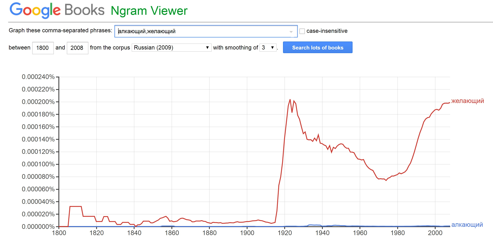

# HW3

1.4.

1.5.

1.6.

2.2.
В моем отрывке текста довольно много устаревших слов, так что я выбрала несколько самых показательных примеров.
Как известно, базы данных НКРЯ и Google Ngrams разные. Поэтому в одних случаях они показывают схожие результаты, а в других ― довольно различные, хоть и не противоположные. Так, в случае с синонимами "алкающий" и "желающий" получены следующие результаты.
 

Как видно, результаты по "алкающему" в отличие от "желающего" очень схожи. С частотой появления слова "желающий" происходят странные метаморфозы: НКРЯ показывает вечно изменяющееся количество вхождений, а в случае с Google Ngrams очевиден резкий взлет популярности слова в 20-х годах XX века.
Другая картина предстает перед нами и в случае с синонимами "днесь" и "сегодня". 
 

Видимо, в базе данных НКРЯ слово "днесь" почти не встречается. Наиболее популярно оно было в начале XIX века, но все же не смогло превзойти "сегодня". С другой стороны, если верить показаниям Google Ngrams "днесь" все же обогнало "сегодня" в том же начале XIX века, и только ближе к 20-м годам уступило первенство сопернику. При этом "сегодня" медленно, но верно набирало популярность и в начале XXI века было на пике своей славы, что отразилось только в Google Ngrams.
Тем не менее с некоторыми словами ситуации очень близки. Так, например, синонимы "если" и "ежели" дают почти одинаковую картинку и в НКРЯ, и в Google Ngrams.
 

Конечно, есть некоторые перегибы на местах в виде большей популярности "ежели" в начале XIX века в базе GOogle Ngrams, но в целом все очень даже стабильно.
Наиболее показателен был бы пример с полностью противоположными графиками. Такого нет, но результаты поиска синонимов "око" и "глаз" тоже очень наглядны.
 

По сведениям НКРЯ, "глаз" весь указанный промежуток времени был гораздо популярнее, чем "око". Конечно, у последнего были свои всплески популярности, но до "глаза" ему далеко. Google Ngrams дает совершенно иные результаты: до начала XX века "око" лидировало, но где-то ближе к 20-м годам "глаз" резко вырвался вперед.

Подобных примеров множество. Какой из этого можно сделать вывод? Корпусы еще очень далеки от идеала, и информация, предоставляемая ими, зачастую не показывает реального положения дел. Точнее, НКРЯ и Google Ngrams создают две различные реальности и дают очень приблизительные результаты. 

2.3.
* Алкающий. 0,02
* Бедство. 0,21
* Брань. 15,22
* Глад. 1,25
* Глас. 9,17
* Днесь. 1,69
* Дщерь. 1,61
* Ежели. 73,06
* Змий. 3,91
* Зреть. 0,59
* Коль. 13,87
* Лилея. 1,15
* Обуять. 2,04
* Око. 38,56
* Песнь. 86,11
* Пламенник. 0,19
* Сей. 578,11

2.4.
Лично мне самой полезной показалась работа с AntConc, потому что я представляю, как могла бы использовать его в своей работе. Возможно, AntConc может помочь выявить какие-либо мотивы, особенно в стихотворных текстах, сборниках лирики. Работа с НКРЯ и Google Ngrams показалась мне интересной, но вряд ли я буду заниматься чем-то, для чего пригодятся эти корпусы. Они помогли только узнать когда и какие слова чаще использовались. Но я бы не хотела пользоваться корпусами с этой целью, потому что результаты они дают очень и очень приблизительные. Скорее я бы смотрела, например, как изменилось употребление какого-нибудь слова или как изменилось управление глагола, может быть, искала бы устойчивые выражения или просто словосочетания. Думаю, такой путь будет более плодотворен, чем эта совсем неточная статистика.
